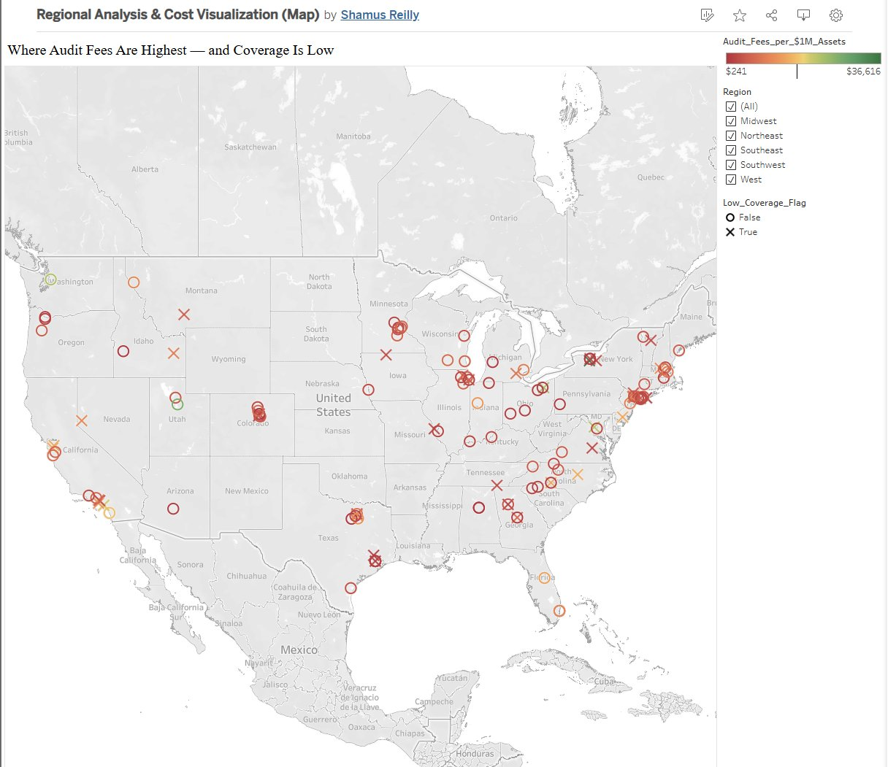
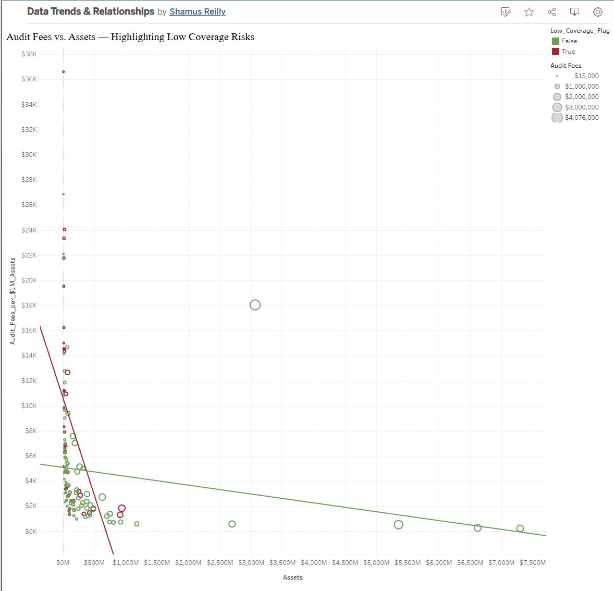
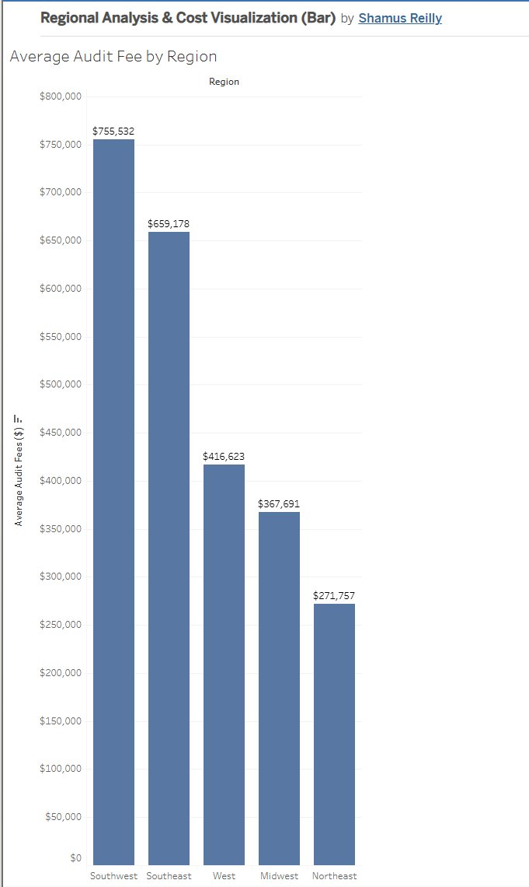
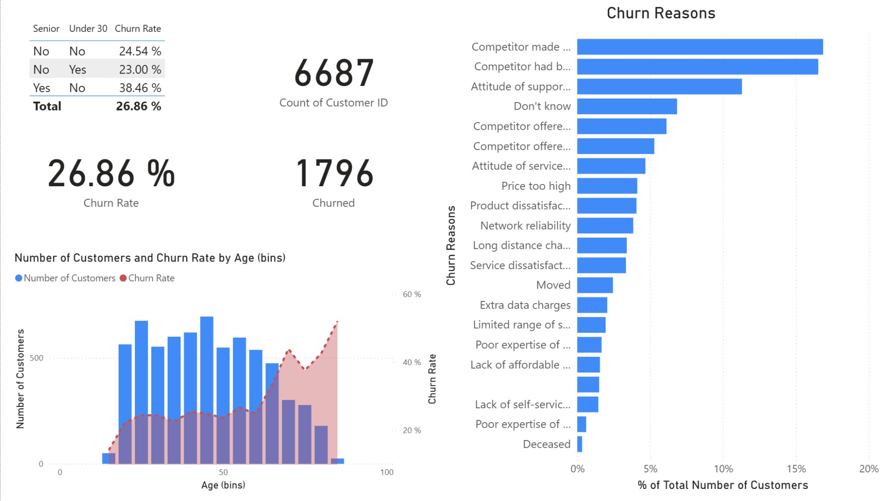

# 👋 Hi, I'm Shamus Reilly, CPA

**Senior Accountant | Accounting, Financial Reporting, Forecasting | Data Analytics**

---

## About Me

I'm a Senior Accountant and CPA with 10+ years of experience across FP&A, corporate accounting, financial reporting, forecasting, and internal audit. I specialize in transforming complex financial data into clear, actionable insights that drive better business decisions. My work consistently improves reporting accuracy, strengthens accounting processes, and increases operational efficiency across Finance, Operations, HR, IT, and Audit.

I combine deep financial expertise with modern analytics tools — Tableau, Power BI, Python, and SQL — to bridge the gap between traditional accounting and data-driven decision making. With certifications spanning Oracle NetSuite, Google Advanced Data Analytics, Microsoft Power BI, and Azure AI, I bring a unique blend of accounting knowledge and emerging technology skills to every project.

I'm currently seeking senior-level opportunities in accounting, FP&A, internal audit, or analytics leadership where I can help organizations scale smarter and make more informed decisions.

---

## 🛠️ Technical Skills

| Category | Skills |
|----------|--------|
| **Visualization** | Tableau, Power BI, DAX, Matplotlib, Seaborn |
| **Programming** | Python (pandas, NumPy, scikit-learn, matplotlib, seaborn), SQL |
| **ERP / Accounting** | Oracle NetSuite, Sage 500, Microsoft Dynamics, Oracle JD Edwards + Hubble Reporting & Analytics, QuickBooks, Excel (advanced), financial modeling |
| **POS & Payment Systems** | Shift4 / Total E+, Loyverse + Elavon, Square |
| **Cloud / AI** | Microsoft Azure AI, Google Cloud |
| **Analytics** | Data modeling, ETL, variance analysis, regression, classification, EDA |
| **Accounting** | FP&A, financial reporting, SOX compliance, month-end close, budgeting & forecasting |

---

## 📜 Certifications

| Certification | Issuer | Date | Verify |
|---------------|--------|------|--------|
| **Certified Public Accountant (CPA)** — License #21954 | Arizona State Board of Accountancy | Nov 2025 | [Verify →](https://www.azaccountancy.gov/CPADirectory/CPASearch.aspx) |
| **Microsoft Certified: Power BI Data Analyst Associate (PL-300)** | Microsoft | Jan 2026 | [Verify →](https://learn.microsoft.com/en-us/users/me/credentials?credentialId=1E6A866ED489BC35) |
| **Google Advanced Data Analytics Specialization** | Google | Jan 2026 | [Verify →](https://www.credly.com/badges/verify?credentialId=MFBS4CNH4MKI) |
| **Microsoft Certified: Azure AI Fundamentals (AI-900)** | Microsoft | Feb 2026 | [Verify →](https://learn.microsoft.com/en-us/users/me/credentials?credentialId=A49FB28901B5257B) |
| **Oracle NetSuite Financial Associate Certification** | Oracle | Feb 2026 | [Verify →](https://www.linkedin.com/in/shamusreilly/details/certifications/) |
| **Oracle NetSuite BI and Reporting Associate** | Oracle | Feb 2026 | [Verify →](https://www.linkedin.com/in/shamusreilly/details/certifications/) |

---

## 📊 Tableau Projects

### Regional Audit Fee Analysis & Cost Visualization

**Tool(s):** Tableau | **Category:** Dashboard / Financial Analysis | **Source:** WGU Coursework

**Problem:** Analyze audit fee patterns across U.S. regions to identify where fees are disproportionately high relative to company assets, and flag areas with low audit coverage that may represent compliance risk.

**Approach:**
- Cleaned and prepared a dataset of 100+ companies with audit fees, assets, financial ratios, and geographic data
- Built calculated fields including `Audit_Fees_per_$1M_Assets` and a `Low_Coverage_Flag` to identify risk
- Designed a multi-view workbook: geographic map, scatter plot with trend lines, and regional bar chart

**Key Insights:**
- Southwest and Southeast regions carry the highest average audit fees ($755K and $659K respectively), nearly 2–3× the Northeast average
- Smaller companies (under $500M in assets) pay disproportionately high audit fees per dollar of assets, with many flagged as low-coverage risks
- Geographic clustering of low-coverage flags in the Mountain West and parts of the Southeast suggests regional gaps in audit market access

**Screenshots:**

  
   <em>Geographic distribution of audit fees per $1M assets with low-coverage flags</em>

  
   <em>Audit fees vs. assets — highlighting low-coverage risks with dual trend lines</em>

  
   <em>Average audit fee by region — Southwest leads at $755K</em>

🔗 **[View on Tableau Public →](https://public.tableau.com/app/profile/shamus.reilly/vizzes)**

---

## 📈 Power BI Projects

### Databel Telecom Customer Churn Analysis

**Tool(s):** Power BI, DAX | **Category:** Dashboard / Business Intelligence | **Source:** Certification Project

**Problem:** Analyze customer churn for Databel, a telecom provider with 6,687 customers, to identify the key drivers behind a 26.86% churn rate and recommend targeted retention strategies.

**Approach:**
- Imported and modeled a 29-column customer dataset covering demographics, usage, contract type, and churn reasons
- Built DAX measures for churn rate calculations, age-bin segmentation, and demographic breakdowns
- Designed an interactive dashboard with KPI cards, churn reason rankings, and age-based trend analysis

**Key Insights:**
- Overall churn rate of **26.86%** (1,796 of 6,687 customers)
- **Senior customers** (65+) churn at **38.46%** — nearly 1.6× the overall rate — representing the highest-risk demographic
- Top churn drivers are competitor-related: better devices and better offers account for the largest share of departures
- Customers under 30 actually have the *lowest* churn rate at 23%, contradicting typical assumptions

**Screenshot:**

  
   <em>Databel churn analysis — KPIs, age segmentation, and churn reason breakdown</em>

---

## 🐍 Python Projects

### Salifort Motors — Employee Retention Prediction

**Tool(s):** Python (pandas, NumPy, scikit-learn, matplotlib, seaborn) | **Category:** Machine Learning / Classification | **Source:** Google Advanced Data Analytics Capstone

**Problem:** Predict which employees are likely to leave Salifort Motors to help HR proactively improve retention and reduce turnover costs.

**Approach:**
- Cleaned a 14,999-row HR dataset: removed 3,008 duplicates (20%), renamed columns, validated data types
- Conducted exploratory data analysis with box plots, scatter plots, count plots, and a correlation heatmap
- Built and evaluated a **Random Forest Classifier** using an 75/25 train-test split

**Key Results:**
- **97% accuracy** on the test set with strong precision and recall
- **Top predictors:** satisfaction level, number of projects, and average monthly hours
- Employees with low satisfaction + high hours + 5+ projects were the highest flight risk
- Recommended proactive monitoring, workload caps at 4 projects, and career development programs for 4-year tenure employees

**Methodology:** PACE Framework (Plan → Analyze → Construct → Execute)

🔗 *Full notebook and code available in this repository*

---

### TikTok Claims Classification Project

**Tool(s):** Python (pandas, NumPy, scikit-learn, scipy, matplotlib, seaborn) | **Category:** Machine Learning / NLP Classification | **Source:** Google Advanced Data Analytics Coursework

**Problem:** Build a machine learning model to classify TikTok videos as "claims" (factual assertions) or "opinions" (subjective viewpoints) to help reduce the content moderation backlog.

**Approach:**
- Analyzed a 19,382-row dataset with 12 variables covering video metadata and engagement metrics
- Handled missing data (298 systematic rows dropped), validated outliers as legitimate viral content (kept)
- Performed hypothesis testing (Welch's t-test) to compare engagement across claim types
- Addressed class imbalance in verified status (93.7% unverified) using upsampling
- Built a **Logistic Regression** classifier with StandardScaler preprocessing

**Key Results:**
- Claims receive significantly higher engagement than opinions across all metrics (views, likes, shares, downloads, comments)
- Banned authors post claims at a disproportionately higher rate than active users
- Verified status is a strong predictor of content type, supporting automated classification
- Model supports scalable triage of flagged content, reducing manual review burden

**Methodology:** PACE Framework (Plan → Analyze → Construct → Execute)

🔗 *Full notebook and code available in this repository*

---

## 📬 Connect With Me

I'm always open to connecting with fellow professionals, discussing data analytics in accounting and finance, or exploring new opportunities.

---

<em>This portfolio is actively maintained. New projects and certifications are added as they're completed.</em>

